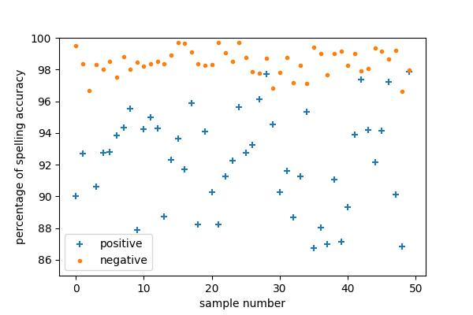

# Dyslexia Detection
## Running the webapp

The app is developed in Python with frontend Developed in streamlit. To run the app in a vertual environment install the packages in ```requirements.txt``` using the command

```
pip install -r requirements.txt
```

Then run the app using

```
streamlit run app.py
```

## Folder structure:

### data

contains the datasets used for Machine learning. The data used is manually collected for the project from the internet and is not medically verified. it may contain unintended biases, use the data at your own risk.

The handwriting samples of the dyslexic childern are in ```dyslexic``` directory and the non-dyslexic samples are in ```non_dyslexic``` directory. 

The ```data.csv``` has the extracted features of all the images in the above directories. the features are as follows:
<ul>
<li>Spelling accuracy</li>
<li>Gramatical accuracy</li> 
<li>Percentage of corrections</li>
<li>Phonetic accuraccy (%)</li>
<li>Presence of dyslexia</li>
</ul>


the ```school_symptoms.txt``` has the symptoms of the disorder documented.

### images:
This folder contains the output images from visualization of the extracted features from the images which explains the accuracy of the classifier on the data.




### model_training:
This folder contains the training and evaluation of various machine learning models on the extracted data.

### app.py:
this file is the main file of the web application. This file has the logic for extracting all the required features from the uploaded image and making a predicton using the pretrained decision tree model.
